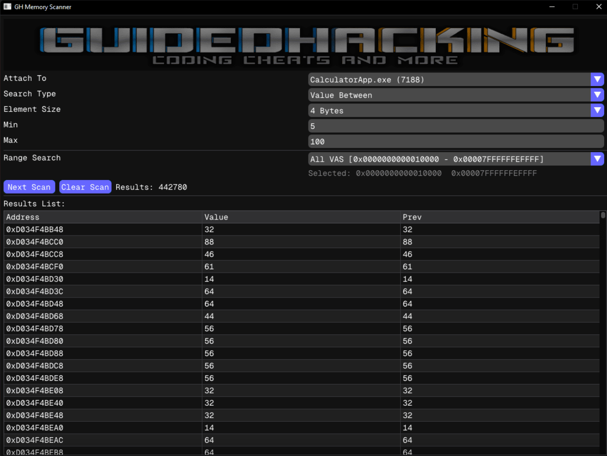

# Memory Scanner Library

The **SlowScanner Library** is a lightweight and flexible memory scanning libary designed to work with custom drivers. It allows you to read and write virtual memory without being blocked by anti-cheats. It doesn't come with an user interface so you have to create your own or

## UI Support

Use the ImGui-powered user interface  available with GHScanner project. GHScanner is protected by copyright and cannot be publicly distributed.

  

The project as well the documentation of SlowScanner is avaiable at  [GuidedHacking](https://guidedhacking.com).

## Current Features
The scanner currently supports the following features:
- Scan types: 1, 2, 4, and 8-byte values, as well as Float and Double (with modes like exact value, less than, greater than, changed, etc.)
- Unknown initial value search
- Range search: specify the memory range to scan
- Multi-scan support

## To Do
- AOB search
- Changing Values

## License
MIT License

Copyright (c) 2025 R1perXNX

Permission is hereby granted, free of charge, to any person obtaining a copy
of this software and associated documentation files (the "Software"), to deal
in the Software without restriction, including without limitation the rights
to use, copy, modify, merge, publish, distribute, sublicense, and/or sell
copies of the Software, and to permit persons to whom the Software is
furnished to do so, subject to the following conditions:

The above copyright notice and this permission notice shall be included in all
copies or substantial portions of the Software.

THE SOFTWARE IS PROVIDED "AS IS", WITHOUT WARRANTY OF ANY KIND, EXPRESS OR
IMPLIED, INCLUDING BUT NOT LIMITED TO THE WARRANTIES OF MERCHANTABILITY,
FITNESS FOR A PARTICULAR PURPOSE AND NONINFRINGEMENT. IN NO EVENT SHALL THE
AUTHORS OR COPYRIGHT HOLDERS BE LIABLE FOR ANY CLAIM, DAMAGES OR OTHER
LIABILITY, WHETHER IN AN ACTION OF CONTRACT, TORT OR OTHERWISE, ARISING FROM,
OUT OF OR IN CONNECTION WITH THE SOFTWARE OR THE USE OR OTHER DEALINGS IN THE
SOFTWARE.
